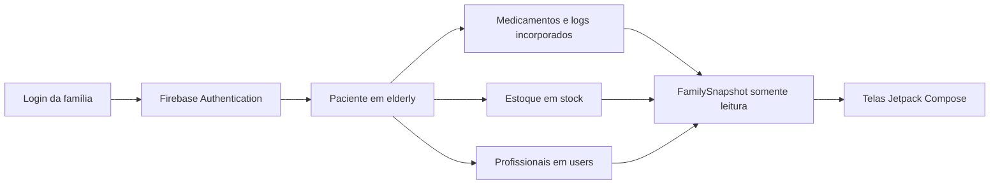

# Carinhosos — acompanhamento familiar de medicamentos

> Projeto Aplicado de Extensão Universitária — Universidade Paulista (UNIP)

Aplicativo Android voltado ao familiar do paciente idoso. A proposta é permitir
que a família acompanhe, de forma clara e segura, as medicações administradas
pela clínica, as ocorrências do tratamento e o estoque individual disponível.

## Experiência da versão 2.0

- Área exclusiva da família com acesso demonstrativo.
- Resumo diário das doses confirmadas pela clínica.
- Linha do tempo com doses administradas, programadas, atrasadas ou suspensas.
- Identificação do horário e do profissional responsável pelo registro.
- Relação completa dos medicamentos, dosagem, orientação e horários.
- Estoque individual por medicamento, nível mínimo e previsão em dias.
- Histórico recente com ocorrências e percentual de acompanhamento.
- Contato rápido com a clínica.
- Preferências para atualizações de doses e alertas de estoque baixo.
- Interface somente de consulta: o familiar não altera prescrições, aplicações
  ou quantidades do estoque.

## Acesso

O usuário `user@mail.com` e a senha da versão anterior foram mantidos para
facilitar o acesso durante a demonstração.

O login agora usa o Firebase Authentication do projeto `extensao-unip`. A conta
demonstrativa é vinculada no cliente ao paciente de demonstração porque esse
vínculo ainda não existe no documento do back-end. Para as demais contas, o app
procura o paciente pelo campo `guardianEmail`.

Os dados exibidos são lidos do Cloud Firestore. O aplicativo não cria, edita ou
exclui pacientes, prescrições, registros de aplicação ou itens de estoque.
As URLs do campo `photo` são carregadas para os avatares de pacientes e
profissionais, com iniciais como fallback em caso de URL vazia ou indisponível.

## Tecnologias

- Kotlin
- Jetpack Compose e Material 3
- Firebase Authentication
- Cloud Firestore
- Gradle
- Android SDK 36

## Fluxo de dados



`FirebaseFamilyRepository` traduz o formato existente do Firestore para os
modelos usados pela interface. `MainActivity` recebe um `FamilySnapshot`
imutável e distribui esse estado pelas telas, sem expor o SDK do Firebase aos
componentes visuais.

## Executar o projeto

Requisitos:

- Android Studio com JDK 17 ou posterior.
- Android SDK 36.
- Aparelho ou emulador com Android 7.0 (API 24) ou posterior.
- Acesso à internet para autenticação, Firestore e imagens remotas.

Abra o projeto no Android Studio, aguarde a sincronização do Gradle e execute o
módulo `app`.

Para compilar pelo terminal no Windows:

```powershell
.\gradlew.bat assembleDebug
```

O APK será criado em `app/build/outputs/apk/debug/app-debug.apk`.

Para executar a mesma validação usada antes da entrega:

```powershell
.\gradlew.bat assembleDebug lintDebug
```

## Estrutura

- `MainActivity.kt`: navegação, estados de login/carregamento e telas em Compose.
- `Models.kt`: modelos de apresentação usados pelas telas.
- `FirebaseFamilyRepository.kt`: autenticação, consultas somente leitura e
  adaptação do contrato atual do Firestore.

## Contrato atual do back-end

- `elderly`: paciente (`name`, `birthDate`, `room`, `photo`), responsável
  (`guardianName`, `guardianEmail`, `guardianPhone`, `guardianRelationship`),
  medicamentos incorporados em `medications` e aplicações em `logs`.
- `stock`: estoque global (`name`, `quantity`, `minQuantity`, `unit`), associado
  ao medicamento pelo nome normalizado.
- `users`: perfis dos profissionais (`name`, `photo`); a imagem é associada ao
  valor de `appliedBy` presente no log.

O app aceita recorrências `Daily`, `Once` e `Interval`, agrupa horários repetidos
do mesmo medicamento e trata estoque ausente como “não informado”. Os registros
administrados vêm de `logs`; os horários ainda pendentes do dia são calculados
localmente a partir de `medications`.

## Imagens e responsividade

O campo `photo` do documento em `elderly` pertence ao paciente, não ao
responsável. Por isso a foto aparece nos cartões e no perfil do paciente, enquanto
o cabeçalho do responsável usa suas iniciais. Fotos dos profissionais aparecem
nos eventos quando o nome pode ser conciliado com a coleção `users`.

Os avatares usam recorte central (`ContentScale.Crop`) dentro de um contêiner
circular e exibem iniciais como fallback. As telas usam listas, pesos e larguras
relativas do Compose, permitindo rotação e diferentes tamanhos de tela sem
distorcer as imagens.

## Decisões e limitações

- O aplicativo é estritamente de consulta: não existem chamadas `set`, `add`,
  `update` ou `delete` no repositório.
- A configuração pública do cliente Firebase fica em `BuildConfig`; ela identifica
  o projeto, mas a autorização efetiva deve ser garantida pelo Authentication e
  pelas regras do Firestore.
- A conta demonstrativa possui um vínculo local temporário com o paciente porque
  o documento atual não contém seu `guardianEmail`. As demais contas são buscadas
  por esse campo.
- Para produção, o back-end deve persistir explicitamente o vínculo entre a conta
  familiar e o paciente e restringir a leitura a esse vínculo nas regras do
  Firestore.

## Informações acadêmicas

- Instituição: Universidade Paulista (UNIP)
- Curso: Ciência da Computação
- Disciplina: Projeto de Extensão Universitária
- Semestre/Ano: 2026

Projeto desenvolvido para fins acadêmicos e sociais.
